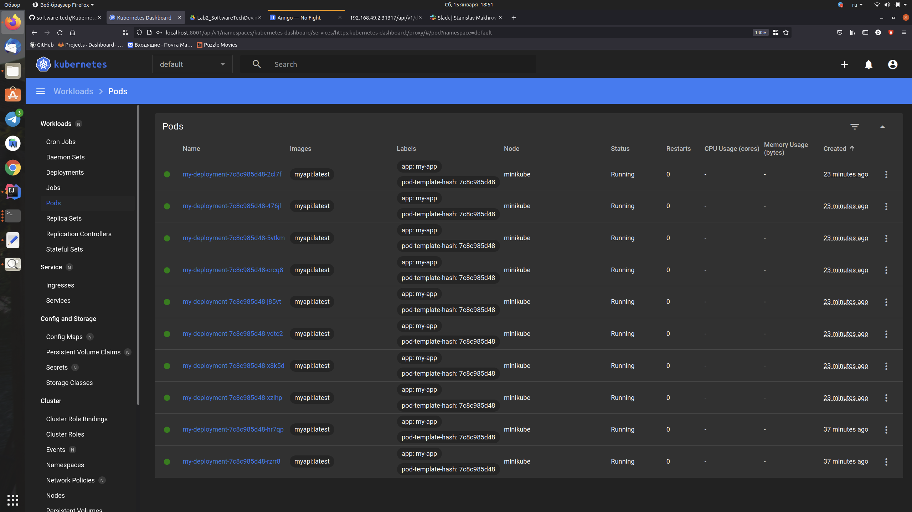

# Технологии разработки программного обеспечения

## Лабораторная работа №2: создание кластера Kubernetes и деплой приложения
Исаев Осман Абдурахманович, МАС2131

Цель лабораторной работы №2: Знакомство с кластерной архитектурой на примере Kubernetes и деплой приложения в кластер.

## deployment.yaml
```
apiVersion: apps/v1
kind: Deployment
metadata:
  name: my-deployment
spec:
  replicas: 10
  selector:
    matchLabels:
      app: my-app
  strategy:
    rollingUpdate:
      maxSurge: 1
      maxUnavailable: 1
    type: RollingUpdate
  template:
    metadata:
      labels:
        app: my-app
    spec:
      containers:
        - image: myapi:latest
          # https://medium.com/bb-tutorials-and-thoughts/how-to-use-own-local-doker-images-with-minikube-2c1ed0b0968
          # указыаает на то, что образы нужно брать только из локального registry. В продакшене никогда не использовать
          imagePullPolicy: Never 
          name: myapi
          ports:
            - containerPort: 8080
      hostAliases:
      - ip: "192.168.49.1" # The IP of localhost from MiniKube
        hostnames:
        - postgres.local
```

## service.yaml
```
apiVersion: v1
kind: Service
metadata:
  name: my-service
spec:
  type: NodePort
  ports:
    - nodePort: 31317
      port: 8080
      protocol: TCP
      targetPort: 8080
  selector:
    app: my-app
```
get po:


Осмотр подов в графическом интерфейсе:



Ссылка на видео: https://disk.yandex.ru/i/KXf7BMJ0dQPpxQ
